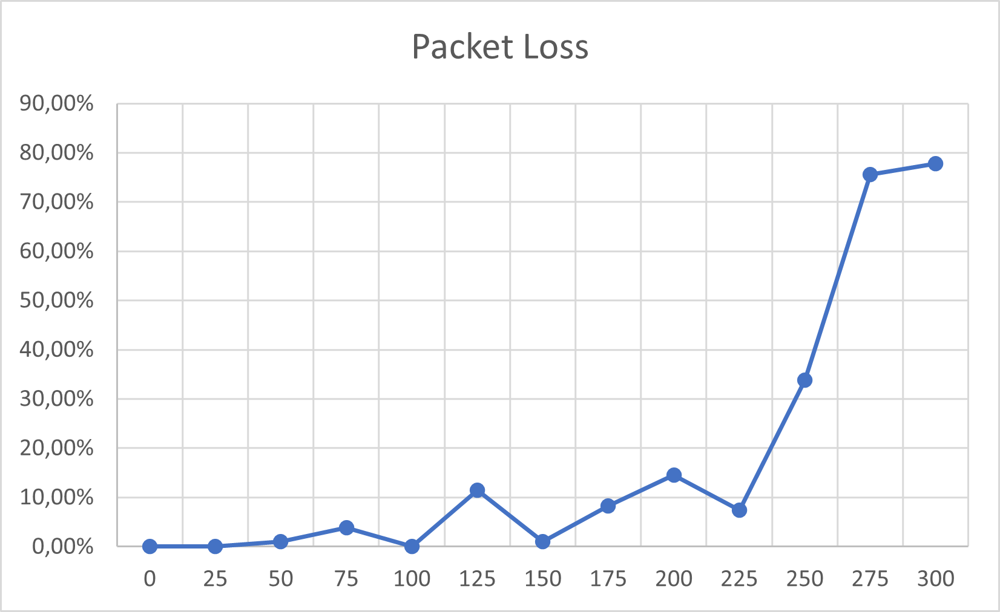

# Range Test

Testing "standard" espnow range, bandwidth, latency and packet loss

## Setup

Tested at "Landebahn Neubiberg" at night (21:00) for low interference and best line-of-sight.

Measurements were taken at 25m intervals (distance meassured using smartphone gps) until the packet loss was ~100%

The base station stays put and the mobile station is moving. By the press of a button on the mobile station, packets are sent to the base station one after another and a response is awaited until the next packet is sent (or a timeout is hit).

Measurement at a single distance are stopped once 100 packets are successfully replied to (i.e. the packet wasn't lost on the roundtrip). The total time of the successful packet roundtrips and the total amount of packets (successful + lost) are saved.

We half the roundtrip time because we are interested in one-way latency.

The code is at `/components/espnow_test`

## Results

The latency stays constant at around 6-7ms.

We achieve a maximum direct line-of-sight distance of 300m. The signal becomes **highly** unstable after that so no real measurements could be taken.

Until 225m the signal stays quite stable at max. packet loss of ca. 15%. After that however, packet loss grows exponentially. We estimate that under real conditions (more interference, foilage in the way), 100-150m range will be easily achievable.

Worth noting is that the signal strength is **VERY** directional. Just tilting the ESP32 a few degrees or people walking in-between the line of sight will vastly increase packet loss at above 200m range.
